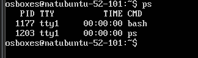
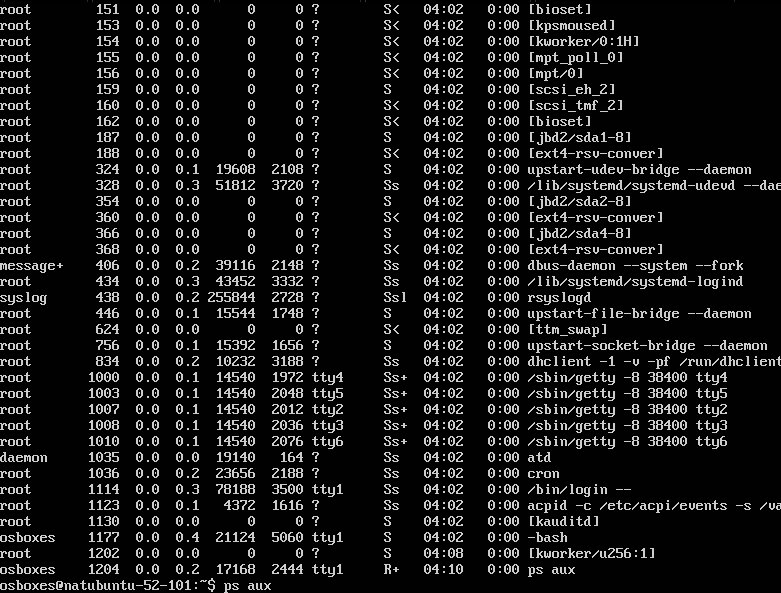
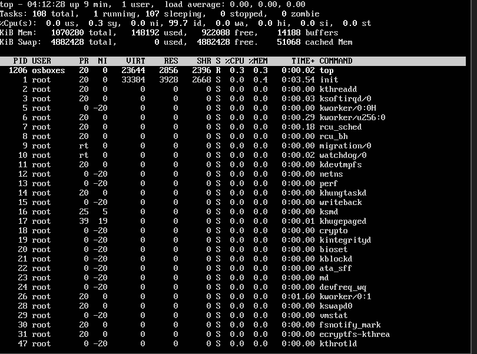
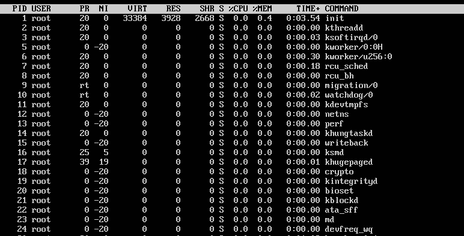
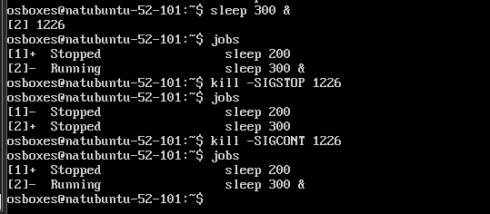
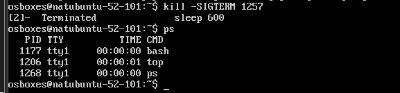
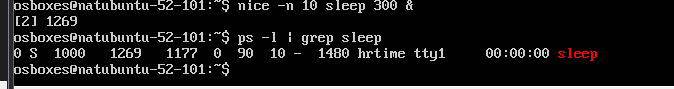
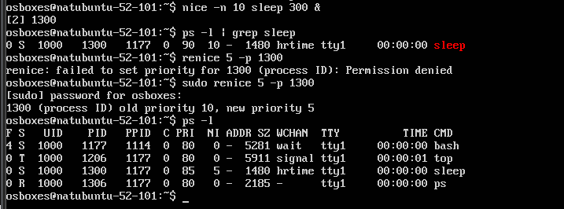
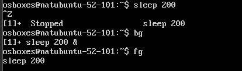
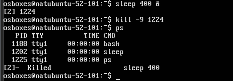

# PR02R3: Gestión de procesos en Linux
Introducción:
El objetivo de esta práctica es familiarizarte con el manejo de procesos en un sistema Linux, utilizando diversas herramientas y comandos para monitorizar, gestionar y manipular procesos.

Pasos a seguir:
Exploración básica de procesos:

Abre una terminal y utiliza el comando ps para listar los procesos asociados a tu usuario. Anota el PID (Process ID) de al menos tres procesos.

Usa el comando ps aux para listar todos los procesos del sistema. Identifica y anota el PID de un proceso que no pertenezca a tu usuario.

Responde a las siguientes preguntas:
¿Qué diferencia hay entre el comando ps y ps aux?

- ps solo muestra procesos de la sesión actual del usuario.
- ps aux muestra todos los procesos del sistema, incluyendo los de otros usuarios y servicios.

Cuando decimos que un proceso pertenece a un usuario, ¿qué implicaciones tiene? Es decir, ¿en qué afecta eso al proceso?

- Solo ese usuario (o root) puede gestionarlo (detenerlo, cambiar su prioridad, etc.).
- Define permisos de acceso a archivos y recursos que el proceso puede utilizar.
  
Monitorización de procesos en tiempo real:

Utiliza el comando top para monitorizar los procesos en tiempo real. Identifica el proceso que consume más CPU y anota su PID.

Cambia la visualización de top para ordenar los procesos por uso de memoria (tecla M). Anota el nombre del proceso que consume más memoria.

Responde a las siguientes preguntas:
¿Qué columnas de información se muestran en top y cuál es su significado?

- PID: Identificador del proceso.
- USER: Usuario propietario del proceso.
- %CPU: Porcentaje de CPU usado.
- %MEM: Porcentaje de RAM usada.
- TIME+: Tiempo total de ejecución.
- COMMAND: Nombre del proceso.

¿Cómo puedes cambiar el intervalo de actualización de top?
- Pulsar d y escribir el nuevo intervalo en segundos.
  
Detener y reanudar procesos:

Ejecuta el comando sleep 300 & para crear un proceso en segundo plano que duerma durante 300 segundos.
Usa el comando jobs para listar los trabajos en segundo plano. Anota el ID del trabajo.
Detén el proceso usando el comando kill con la señal SIGSTOP. Verifica que el proceso esté detenido.
Reanuda el proceso usando el comando kill con la señal SIGCONT. Verifica que el proceso esté en ejecución nuevamente.

Responde a las siguientes preguntas:
¿Qué efecto tiene la señal SIGSTOP sobre un proceso?

- Pausa el proceso sin terminarlo.

¿Cómo puedo verificar si un proceso está detenido o en ejecución?

- ps (ver estado T para "stopped").

Terminar procesos:

Crea un proceso en segundo plano con el comando sleep 600 &.

Usa el comando ps para encontrar el PID del proceso sleep.

Termina el proceso usando el comando kill con la señal SIGTERM. Verifica que el proceso haya sido eliminado.

Responde a las siguientes preguntas:
¿Qué diferencia hay entre las señales SIGTERM y SIGKILL?

- SIGTERM solicita una terminación limpia.
- SIGKILL fuerza la terminación sin liberar recursos.
  
¿Por qué es preferible utilizar SIGTERM antes que SIGKILL para terminar un proceso?

- Para permitir que el proceso cierre correctamente.

Prioridades de procesos:

Ejecuta el comando nice -n 10 sleep 300 & para crear un proceso con una prioridad baja.
Usa el comando ps -l para ver la prioridad (NI) del proceso. Anota el valor de NI.

Cambia la prioridad del proceso usando el comando renice. Establece la prioridad a 5 y verifica el cambio con ps -l.

Responde a las siguientes preguntas:
¿Para qué sirve el comando nice?

- Define la prioridad con la que inicia un proceso.
  
¿Qué rango de valores puede tomar la prioridad (nice value) de un proceso y qué significa cada extremo?

- De -20 (más prioridad) a 19 (menos prioridad).
  
¿Qué ocurre si intentas cambiar la prioridad de un proceso que no te pertenece?

-Se necesita permisos de superusuario.

Procesos en primer y segundo plano:

Ejecuta el comando sleep 200 en primer plano. Detén el proceso usando Ctrl+Z.
Usa el comando bg para mover el proceso detenido a segundo plano.
Trae el proceso de segundo plano a primer plano usando el comando fg.

Responde las siguientes preguntas:
¿Qué significa que un proceso está en segundo plano?

-Se ejecuta sin bloquear la terminal.

¿Qué comando utilizarías para mover un proceso detenido a segundo plano?

-bg.

¿Cómo puedes traer un proceso de segundo plano a primer plano si tienes múltiples trabajos en segundo plano?

-fg %<número> (ejemplo: fg %1).

Uso de pstree y htop:

Instala la herramienta htop si no está disponible en tu sistema (sudo apt install htop).
Usa htop para explorar los procesos de manera interactiva. Filtra los procesos por usuario y anota el nombre de un proceso que pertenezca a otro usuario.
Usa el comando pstree para visualizar los procesos en forma de árbol. Identifica un proceso padre y sus procesos hijos, y anota sus nombres.
Responde las siguientes preguntas:
¿Qué ventaja tiene utilizar pstree frente a ps para visualizar procesos?

-Muestra jerarquía de procesos en forma de árbol.

¿Cómo puedes filtrar procesos por usuario en htop?

-Pulsar F4 y escribir el nombre del usuario.

Matar procesos de manera forzosa:

Crea un proceso en segundo plano con sleep 400 &.
Usa el comando kill -9 para terminar el proceso de manera forzosa. Verifica que el proceso haya sido eliminado.

Responde las siguientes preguntas:
¿En qué casos sería necesario usar kill -9 en lugar de kill sin opciones?

-Si el proceso no responde a SIGTERM.

¿Qué riesgos implica usar SIGKILL para terminar un proceso?

-Puede causar pérdida de datos o corrupción de archivos.