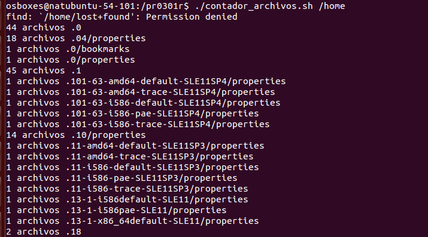

# PR03R1: Bash Scripting
1. Calculadora básica
Crea un script que funcione como una calculadora de operaciones básicas.

Debe recibir como parámetros:

Primer número
Operación (+, -, *, /)
Segundo número Si no se pasan parámetros, debe solicitar los valores al usuario.
Debe manejar errores, como división por 0.
Ejemplo de uso:

./calculadora.sh 10 + 5
# Salida esperada:
# 10 + 5 = 15

```bash
#!/bin/bash

if [ $# -ne 3 ]; then
    read -p "Primer número: " num1
    read -p "Operación (+, -, *, /): " op
    read -p "Segundo número: " num2
else
    num1=$1
    op=$2
    num2=$3
fi

if [[ $op == "/" && $num2 == 0 ]]; then
    echo "Error: División por 0"
    exit 1
fi

resultado=$(echo "$num1 $op $num2" | bc -l)
echo "$num1 $op $num2 = $resultado"

```


2. Validador de direcciones IP
Crea un script que verifique si una dirección IP es válida.

Debe recibir la dirección IP como parámetro.
Si no se pasa, debe pedirla al usuario.
Usa grep para validar el formato X.X.X.X, donde X es un número que tiene entre 1 y 3 dígitos.
Ejemplo de uso:

./validar_ip.sh 192.168.1.1
# Salida esperada:
# La IP 192.168.1.1 es válida.

```bash
#!/bin/bash

ip=$1
if [ -z "$ip" ]; then
    read -p "Introduce una dirección IP: " ip
fi

if echo "$ip" | grep -E -q '^([0-9]{1,3}\.){3}[0-9]{1,3}$'; then
    echo "La IP $ip es válida."
else
    echo "La IP $ip NO es válida."
fi
```


3. Contador de archivos por tipo
Crea un script que cuente archivos de distintos tipos en un directorio.

Debe recibir el directorio como parámetro (si no se pasara el parámetro lo solicitará por teclado).
Mostrará cuántos archivos hay de cada extensión (.txt, .sh, .log, etc.).
Usa find y grep para procesar los datos.
Ejemplo de uso:

./contador_archivos.sh /home/user
# Salida esperada:
# 10 archivos .txt
# 5 archivos .log
# 3 archivos .sh

```bash
#!/bin/bash

dir=$1
if [ -z "$dir" ]; then
    read -p "Introduce el directorio: " dir
fi

find "$dir" -type f | sed 's|.*\.||' | sort | uniq -c | while read count ext; do
    echo "$count archivos .$ext"
done

```



4️. Comprobador de estado de páginas web
Crea un script que verifique si una página web está accesible.

Debe recibir una URL como parámetro
Debe hacer un curl para comprobar si responde con código 200.
Si está caída, debe mostrar una alerta.
Ejemplo de uso:

./check_web.sh https://google.com
# Salida esperada:
# La web https://google.com está operativa.
```bash
#!/bin/bash

url=$1
if [ -z "$url" ]; then
    read -p "Introduce la URL: " url
fi

codigo=$(curl -s -o /dev/null -w "%{http_code}" "$url")

if [ "$codigo" == "200" ]; then
    echo "La web $url está operativa."
else
    echo "Alerta: La web $url no responde correctamente (Código: $codigo)."
fi

```

5. Monitor de uso de CPU y RAM
Crea un script que muestre el uso actual de CPU y memoria del sistema.

No necesita parámetros.
Debe mostrar la información en un formato claro.
Usa top, free o vmstat.
Ejemplo de uso:

./monitor_recursos.sh
# Salida esperada:
# Uso de CPU: 23%
# Uso de RAM: 1.5 GB / 8 GB (18%)
```bash 
#!/bin/bash

cpu=$(top -bn1 | grep "Cpu(s)" | awk '{print 100 - $8 "%"}')
mem_info=$(free -m | awk '/Mem:/ {printf "%.1f GB / %.1f GB (%.0f%%)\n", $3/1024, $2/1024, $3/$2*100}')

echo "Uso de CPU: $cpu"
echo "Uso de RAM: $mem_info"

```
6. Backup de un directorio
Descripción:

Crea un script que realice una copia de seguridad de un directorio.

Debe recibir el directorio origen y el directorio destino como parámetros.
Si no se pasan, debe solicitarlos.
Usa el comando tar para generar el backup con la fecha actual en el nombre.
Ejemplo de uso:

./backup.sh /home/user/docs /backups
# Salida esperada:
# Backup creado: /backups/docs_20250328.tar.gz
```bash
#!/bin/bash

src=${1:-$(read -p "Directorio origen: " tmp && echo $tmp)}
dst=${2:-$(read -p "Directorio destino: " tmp && echo $tmp)}

if [ ! -d "$src" ]; then echo "Origen no válido"; exit 1; fi
if [ ! -d "$dst" ]; then echo "Destino no válido"; exit 1; fi

fecha=$(date +%Y%m%d)
nombre=$(basename "$src")_"$fecha".tar.gz

tar -czf "$dst/$nombre" -C "$(dirname "$src")" "$(basename "$src")"

echo "Backup creado: $dst/$nombre"
```

7. Conversor de temperatura (Celsius ⇄ Fahrenheit)
Crea un script que convierta una temperatura entre Celsius y Fahrenheit.

Debe recibir la temperatura y la unidad como parámetros (C o F).
Si no se pasan, debe solicitarlos al usuario.
Ejemplo de uso:

./temperatura.sh 100 C
# Salida esperada:
# 100°C = 212°F
```bash
#!/bin/bash

temp=${1:-$(read -p "Temperatura: " tmp && echo $tmp)}
unit=${2:-$(read -p "Unidad (C/F): " tmp && echo $tmp)}

if [[ "$unit" =~ ^[Cc]$ ]]; then
    f=$(echo "scale=2; $temp * 9 / 5 + 32" | bc)
    echo "$temp°C = $f°F"
elif [[ "$unit" =~ ^[Ff]$ ]]; then
    c=$(echo "scale=2; ($temp - 32) * 5 / 9" | bc)
    echo "$temp°F = $c°C"
else
    echo "Unidad no válida. Usa C o F."
fi
```

8. Generador de nombres de archivos aleatorios
Crea un script que genere un nombre aleatorio para un archivo.

Debe aceptar una extensión como parámetro.
Si no se pasa, debe preguntar al usuario.
Usa /dev/urandom o date para generar nombres únicos.
Ejemplo de uso:

./nombre_archivo.sh txt
# Salida esperada:
# Nombre generado: archivo_x7a9.txt

```bash
#!/bin/bash

ext=${1:-$(read -p "Extensión: " tmp && echo $tmp)}
nombre="archivo_$(date +%s%N | sha256sum | head -c 5).$ext"
echo "Nombre generado: $nombre"

```
9. Script para comparar dos archivos
Crea un script que compare dos archivos y muestre las diferencias.

Debe recibir los dos archivos como parámetros.
Si no se pasan, debe solicitarlos.
Usa diff para comparar y mostrar diferencias resaltadas.
Ejemplo de uso:

./comparar.sh file1.txt file2.txt
# Salida esperada:
# Diferencias encontradas:
# - Línea 3: "Hola mundo" → "Hola amigo"

```bash
#!/bin/bash

archivo1=${1:-$(read -p "Archivo 1: " tmp && echo $tmp)}
archivo2=${2:-$(read -p "Archivo 2: " tmp && echo $tmp)}

if [ ! -f "$archivo1" ] || [ ! -f "$archivo2" ]; then
    echo "Archivos no válidos."
    exit 1
fi

diff -u "$archivo1" "$archivo2"

```
10. Generador de números aleatorios dentro de un rango
Crea un script que genere un número aleatorio entre un mínimo y un máximo.

Debe recibir los valores mínimo y máximo como parámetros.
Si no se pasan, debe solicitarlos al usuario.
Usa $RANDOM para generar el número.
Ejemplo de uso:

./random.sh 1 100
# Salida esperada:
# Número generado: 57

```bash
#!/bin/bash

min=${1:-$(read -p "Mínimo: " tmp && echo $tmp)}
max=${2:-$(read -p "Máximo: " tmp && echo $tmp)}

if ! [[ "$min" =~ ^[0-9]+$ && "$max" =~ ^[0-9]+$ && "$min" -lt "$max" ]]; then
    echo "Rango no válido."
    exit 1
fi

echo $(( RANDOM % (max - min + 1) + min ))

```
