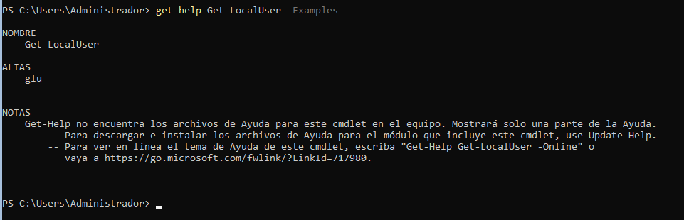
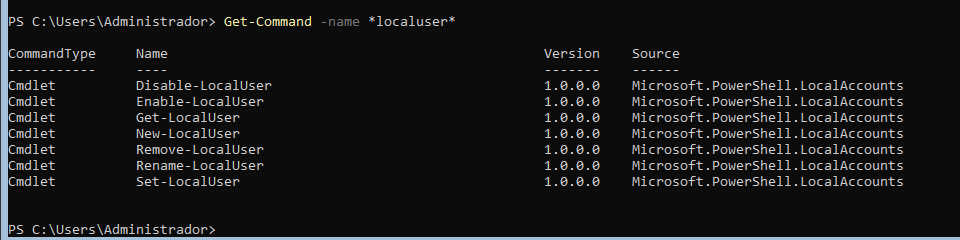
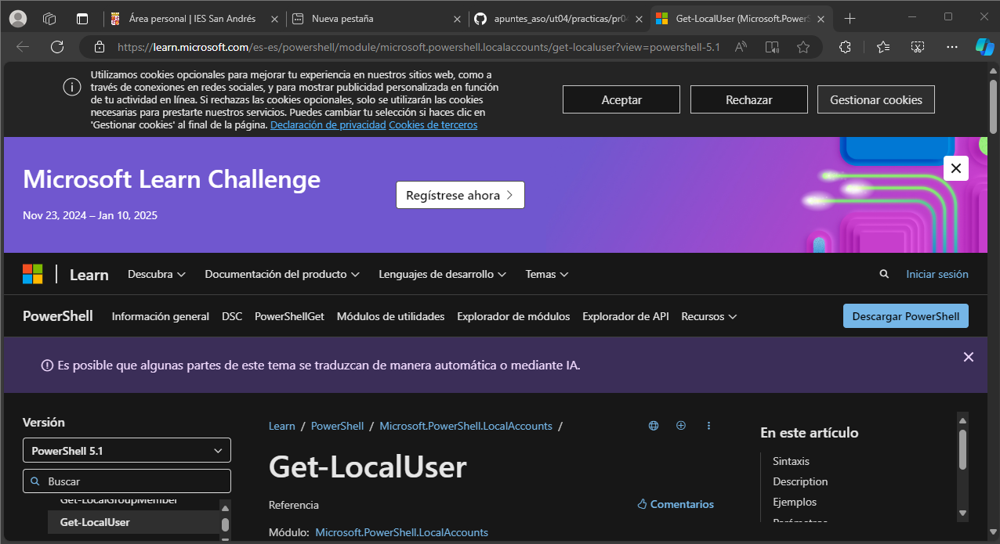
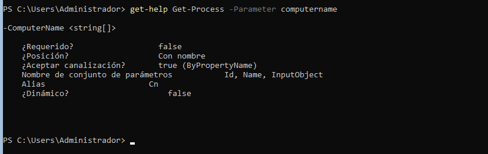
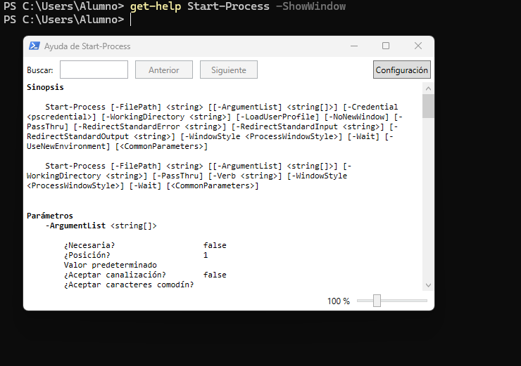
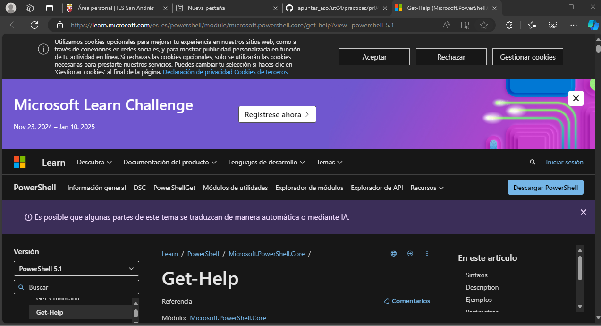
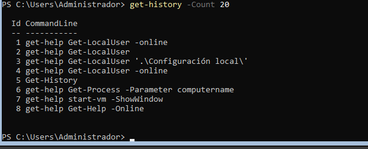
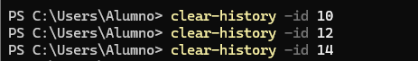
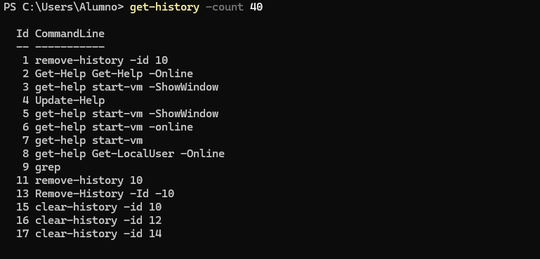

# PR0401: Introducción a Powerhsell

Realiza las siguientes tareas que se te piden utilizando Powershell. Para contestar lo mejor es que hagas una captura de pantalla donde se vea el comando que has introducido y las primeras líneas de la salida de este.

Obtén ejemplos de utilización del comando `Get-LocalUser`.





Obtén un listado de todos los comandos relacionados con la gestión de usuarios locales (es decir, con el nombre LocalUser).





Utilizando la línea de comandos, muestra en el navegador la ayuda del comando Get-LocalUser.


```powershell
get-help Get-LocalUser -Online
```

Averigua para qué sirve el comando Set-Content y explícalo brevemente con tus palabras.
```powershell
El comando Set-Content se utiliza para escribir o reemplazar contenido en un archivo.
```
Explica tres formas diferentes de ver o buscar un comando que hayas utilizado anteriormente en tu sesión.
```powershell
*Con el comando Get-history.
*Presionando las teclas de arriba o abajo para ver los comandos usados anteriormente.
*Usando Ctrl + R
```
Averigua si el comando Get-Process tienen un parámetro llamado ComputerName y en caso afirmativo explica para qué sirve.


```powershell
Si existe, este parámetro permite especificar el nombre del equipo remoto del que deseas obtener información sobre procesos.
```

Muestra la ayuda del comando Start-VM en una ventana emergente.



Muestra la ayuda del comando Get-Help en el navegador invocándolo desde la línea de comandos.


```powershell
Get-Help Get-Help -Online
```

Muestra las últimas 20 entradas del historial.



Elimina las entradas 10, 12 y 14 de tu historial.



