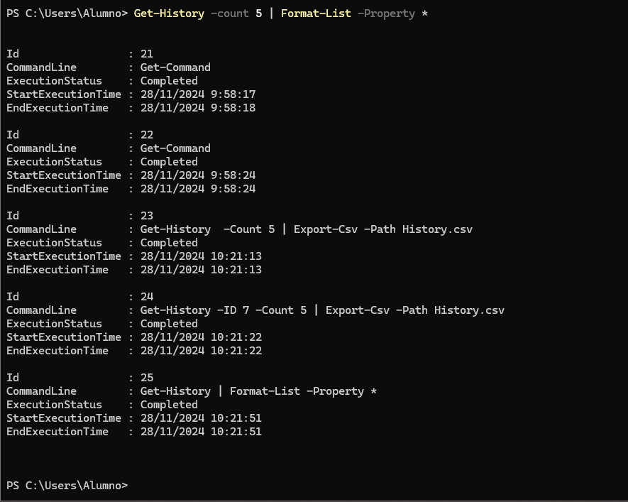
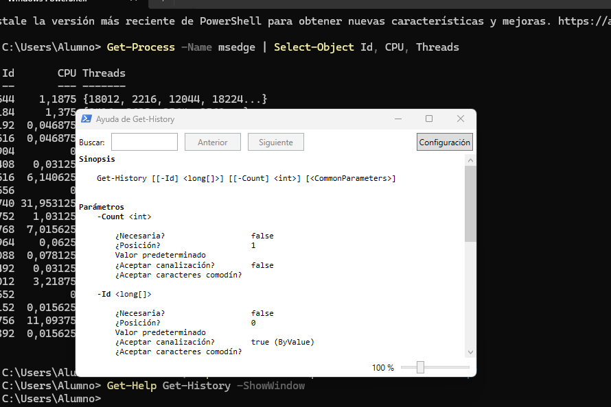

 # PR0402: Introducción a Powershell (II)

Realiza las siguientes tareas que se te piden utilizando Powershell. Para contestar lo mejor es que hagas una captura de pantalla donde se vea el comando que has introducido y las primeras líneas de la salida de este.

Visualiza las últimas cinco entradas del historial, mostrando para cada una el comando, la hora en que finalizó su ejecución y el estado de ejecución.



Ejecuta el comando Get-Command (que muestra todos los comandos disponibles en Powershell) e interrúmpelo antes de que finalice su ejecución pulsando las teclas Ctrl-C. A continuación, ejecútalo dejando que finalice correctamente.


Vuelve a ejecutar el comando del punto 1 y comprueba las diferentes salidas de finalización de estado de ejecución.


Muestra todos los procesos con el nombre msedge mostrando para cada uno el identificador, el consumo de CPU y los hilos (threads)


Averigua para qué sirve el parámetro -Delimiter del comando Export-CSV
```Powershell
Sirve para especificar un delimitador personalizado al exportar datos a un archivo CSV.
```


Muestra en una ventana la ayuda del comando Get-History



Muestra un listado con todos los comandos que tengan el verbo Update.


Ejecuta la herramienta Recortes y localízala usando el comando Get-Process teniendo en cuenta que el proceso se llama SnippingTool.exe


Averigua qué propiedades tienen los procesos devueltos con el comando Get-Process.


Busca en la ayuda para qué sirve el parámetro -MemberType del comando Get-Member.


Desde la línea de comandos, finaliza la ejecución de la herramienta Recortes.


Muestra todos los procesos que tienen el nombre svchost.


Muestra por pantalla el número de instancias del proceso svchost.


Muestra por pantalla todos los procesos con el nombre svchost mostrando para cada uno: nombre, identificador, hora de inicio, tiempo total de procesador y clase de prioridad. Se deben mostrar de forma tabular.


Repite la búsqueda anterior, pero ordenando por el campo tiempo total de procesador en sentido descendente.

```Powershell
Get-Process -Name svchost | Sort-Object TotalProcessorTime -Descending | Select-Object Name, Id, StartTime, TotalProcessorTime, PriorityClass | Format-Table
```


Muestra los usuarios que hay en el sistema agrupándolos por la propiedad Enabled.


Muestra los usuarios que hay en el sistema con la cuenta habilitada (propiedad Enabled puesta a True). Utiliza el filtrado con el comando Where-Object


Muestra un listado de todos los usuarios del sistema con el nombre y la fecha de la última vez que iniciaron sesión (tienes que buscar la propiedad que indique último inicio de sesión o last logon)


