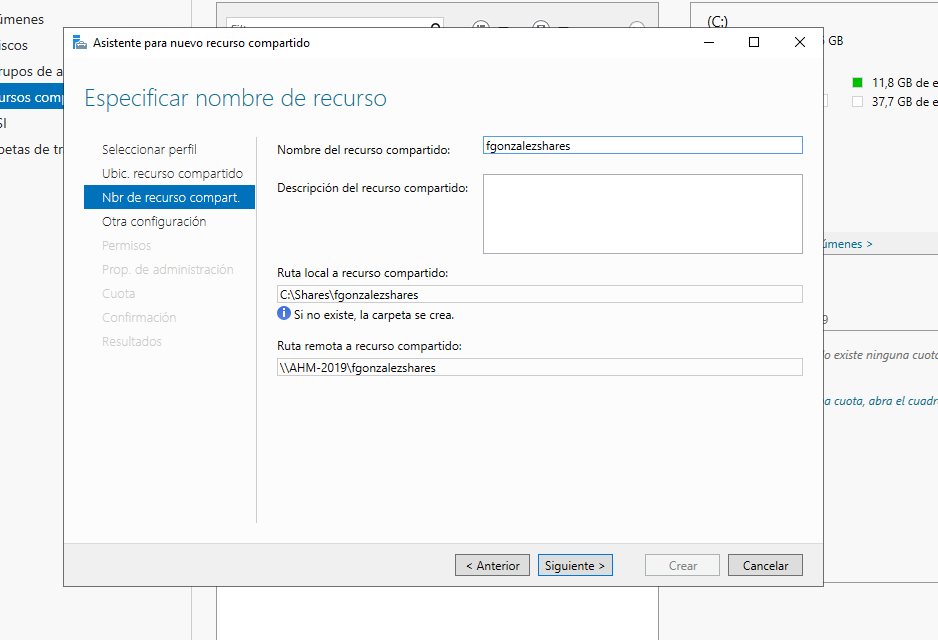

# PR0501: Carpetas personales y compartidas por un grupo
Realiza los siguiente pasos en tu dominio:

Creación de usuarios y grupos
Crea en tu dominio los usuarios aperez y fgonzalez.

Crea un grupo global denominado alumnos y agrega los usuarios que creaste anteriormente.

Carpetas personales
Instala el Administrador de recursos del servidor de archivos que está dentro del rol Servicios de archivos y almacenamiento

Utilizando la herramienta Servicios de archivos y de almacenamiento del Administrador del servidor, crea una carpeta para cada usuario dentro de C:\shares y realiza los pasos necesarios para que ambos usuarios puedan ver esta carpeta como una unidad de red identificada con la letra H:

Comprueba que la carpeta de cada usuario solo pueda ser accedida por él mismo.
Carpetas compartidas por un grupo
Crea en C:\shares una carpeta llamada apuntes y realiza las tareas necesarias para que los usuarios del grupo alumnos puedan acceder a ella como un espacio de almacenamiento compartido.

