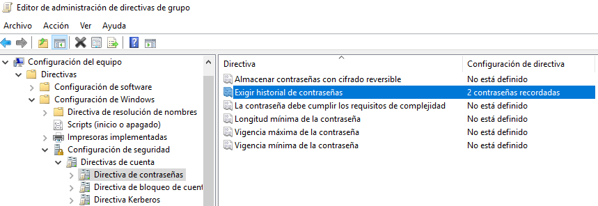
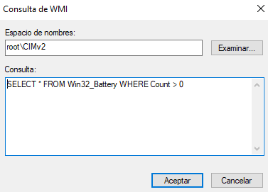

# PR0501: Aplicación de directivas
Eres el administrador de sistemas de una empresa que cuenta con las siguientes características:

Dominio: aso.local
Unidades Organizativas:

Usuarios: contiene los usuarios del dominio, divididos en dos unidades organizativas:
management.

development.

Equipos: Contiene los equipos de los empleados.

Requisitos
Directiva 1
Directiva: No se puede cambiar el fondo de pantalla del escritorio (Configuración de usuario -> Plantillas administrativas -> Escritorio)

A quienes se aplica: a los usuarios del grupo management

Cuando hayamos hecho esto, podremos vincular nuestra Directiva 1 a la UO management desde el Administrador de directivas de grupo, pulsando botón derecho sobre la UO > Vincular un GPO existente...:

Directiva 2
Directiva: se pueden ejecutar scripts de Powershell sin restricciones (Configuración de equipo -> Plantillas administrativas -> Componentes de Windows -> Windows Powershell).
A quienes se aplica: a los usuarios del grupo development

Directiva 3
Directiva: el firewall de Windows está habilitado (Configuración de equipo -> Directivas -> Configuración de Windows -> Configuración de seguridad -> Windows Defender Firewall -> Perfil del dominio)
A quienes se aplica: todos los equipos del dominio
Excepciones: esta directiva no debe aplicarse a un equipo específico denominado DEV-PC1

Para excluir el equipo DEV-PC1, emplearemos una consulta WMI con el siguiente contenido, seleccionándola en Filtrado WMI del Ámbito de la directiva:

Directiva 4
Directiva: configura las actualizaciones para que se descarguen automáticamente y se instalen fuera del horario laboral (Configuración de equipo -> Directivas -> Plantillas administrativas -> Componentes de Windows -> Windows Update -> Configurar actualizaciones automáticas)
A quienes se aplica: a todos los equipos del dominio

En la ruta indicada, Habilitamos la Directiva y seleccionamos la opción 4 - Descargar automáticamente y programar la instalación. Yo la he programado para que se actualice semanalmente a las 3 de la mañana:

La vinculamos al dominio

Directiva 5
Directiva: desactivar el acceso de lectura y escritura a dispositivos USB (Configuración de equipo -> Directivas -> Plantillas administrativas -> Sistema -> Acceso de almacenamiento extraíble)
A quienes se aplica: a todos los equipos del dominio

Directiva 6
Directiva: el usuario no podrá repetir ninguna de las 10 últimas contraseñas-
A quienes se aplica: a todos los usuarios del dominio
Excepciones: habrá dos usuarios en el dominio llamados mgmt_director y dvlp_directo, que pertenecen a las UO management y development respectivamente que no podrán repetir ninguna de las 2 últimas contraseñas.

Ahora vamos a crear otra directiva (Directiva 6.a) para configurar que los usuarios mgmt_director y dvlp_directo no puedan repetir sus últimas 2 contraseñas:

Vincularemos esta nueva GPO a las UO development y management, fijándonos que en la pestaña Herencia de directivas de grupo figure con más Prioridad la Directiva 6.a que la Directiva 6, para que se aplique la configuración de 2 contraseñas en lugar de la de 10:

Directiva 7
Directiva: especifica que los equipos portátiles pasen a hibernación después de 30 minutos de inactividad (Configuración de equipo -> Plantillas administrativas -> Sistema -> Administración de energía)
A quienes se aplica: a los equipos portátiles, por lo que tendrás que utilizar un filtro WMI (necesitarás la clase Win32_Battery)

Localizamos la directiva en la ruta indicada > Configuración de suspensión > Especificar el tiempo de espera para la hibernación del sistema (conectado), donde la Habilitaremos configurada para 1800 segundos.

Filtro WMI seleccionado en el Ámbito de la Directiva 7:
