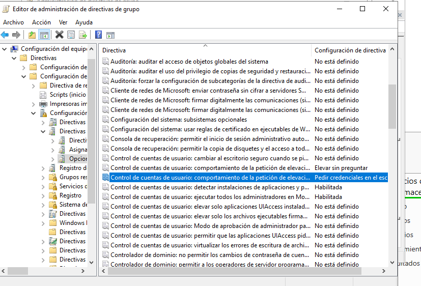

## PR05R1: Creación de dominio y GPOs
Para realizar esta práctica debes utilizar una máquina con Windows Server que hayas promovido a controlador de dominio.

1.- Creación de objetos
Crea los siguientes objetos en tu dominio:

Unidades organizativas: crea las unidades OU_Informática, OU_Administración y OU_ESO. Crea también OU_ASIR, OU_SMR y OU_DAM dentro que la primera.
Usuarios: crea algunos usuarios para tu dominio, tres para cada una de las unidades organizativas que hemos creado (solo las de informática). Puedes llamarlos, por ejemplo, usr01asir, usr01smr,... Crea también dos usuarios profesor01 y profesor02.
Grupos: crea un grupo para cada una de las unidades organizativas de informática llamados grpASIR, grpSMR y grpDAM que contengan todos los usuarios de cada UO. Crea también un grupo llamado grpDelegados que incluya el primer usuario de cada UO (usr01asir, usr01smr y usr01daw).
Equipos: si no has agregado la máquina con Windows 10 al dominio este es el momento de hacerlo. Inclúyelo en la UO de ASIR.

Vamos creando los usuarios que se nos pide en cada OU

 

Creamos los grupos y añadimos los usuarios que se piden 

2.- GPOs
Realiza los siguientes pasos:

Parte 1
Crea una GPO en la que solo habilitarás la directiva de Quitar panel de control.

Vincula esa directiva a OU_Informática.

Verifica que hace lo que tiene que hacer.
Realiza los pasos necesarios para que la directiva NO se aplique a los alumnos de ASIR y verifícalo.

Parte 2
Crea otra GPO diferente que impida al usuario ejecutar cmd.exe

Esta GPO se aplicará a todos los delegados.

Parte 3
Otra directiva más, esta vez que impida ejecutar el administrador de tareas

Esta se aplicará a todos los usuarios de la unidad organizativa informática salvo a los delegados. Además, solo se aplicará a los equipos que tengan más de 1536 MB de RAM.

3.- Más GPOs
Vamos a modificar ahora las directivas de contraseñas. Las contraseñas de todos los usuarios del dominio deben tener las siguientes características:

No son necesarios los requisitos de complejidad
Tendrán una longitud mínima de 4 caracteres
Si el usuario se confunde tres veces al introducir la contraseña se bloqueará la cuenta durante 7 minutos.
El usuario no podrá reutilizar ninguna de las 13 últimas contraseñas que ha utilizado.

En lugar de modificar la GPO Default Domains Policy, crea una GPO nueva que tenga más prioridad que la anterior.

Esta GPO no podrá ser bloqueada

4.- GPO de control de cuentas de usuario
Habilita mediante GPOs y para todos los usuarios del dominio el control de cuentas de usuario de forma que cuando un usuario requiera elevación de privilegios se le pidan las credenciales en el escritorio seguro. Esta directiva no se aplicará a los administradores del dominio, configurándola de forma que no se les preguntará (a los administradores) nada cuando requieran elevación de permisos

5.- GPO aplicada a equipos
Vamos a suponer ahora que cada uno de los grupos tiene un equipo que corresponde al profesor. Añade equipos al dominio con los nombres asir1_profe, asir2_profe, dam1_profe,... en inclúyelos en las respectivas unidades organizativas. Crea una GPO que renombre la cuenta de administrador en estos equipos para que se llame SysAccount. Comprueba que funciona.

